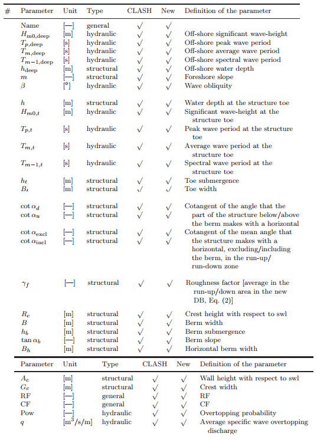
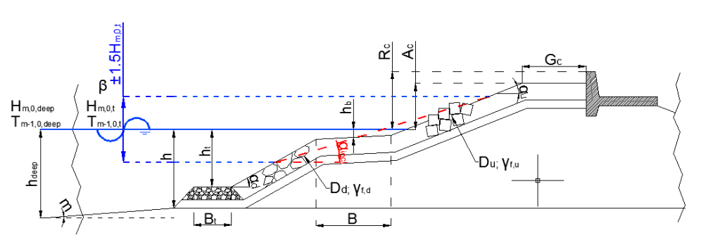
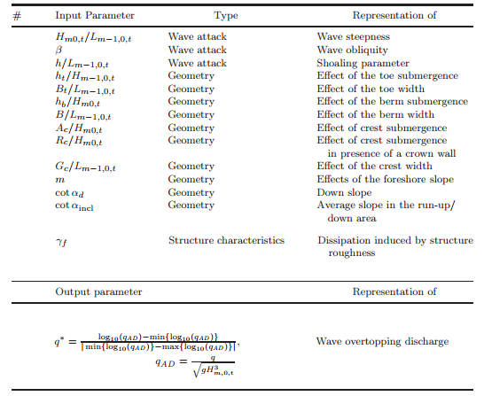

# Overtopping discharge predictions using machine learning algorithms

The overtopping discharge is usually computed from an empirical method explains in the [Eurotop manual](http://www.overtopping-manual.com). These analytical methods are targeted to represent specific structures types, often quite simple geometries and are far from providing a complete description of all coastal structures types and performances.   

This notebook is a use case focusing on the overtopping discharge predictions with Machine learning algorithms. For the task, i use the CLASH database consisting of large number of physical model.

### Clash database

The dataset is composed for each physical run of 31 inputs described below :

RF indicates how reliable a test is on the basis of the available information.
CF indicates how well a structure geometry could be described by the geometrical parameters considered in the database. 

A value of 4 for RF and CF means that the test was so unreliable or so complex that it should not be considered neither for further analysis nor for training. 

### Training database

For performs the regression task, the input parameters are made dimensionless with physically based motivations. The wave overtopping discharge 'q' is also converted to dimensionless form and rescaled.

### Prediction models

For the task, SVr and GBr models have been trained and tested. For a better score, the combination of these models has been set up with a voting regressor.
